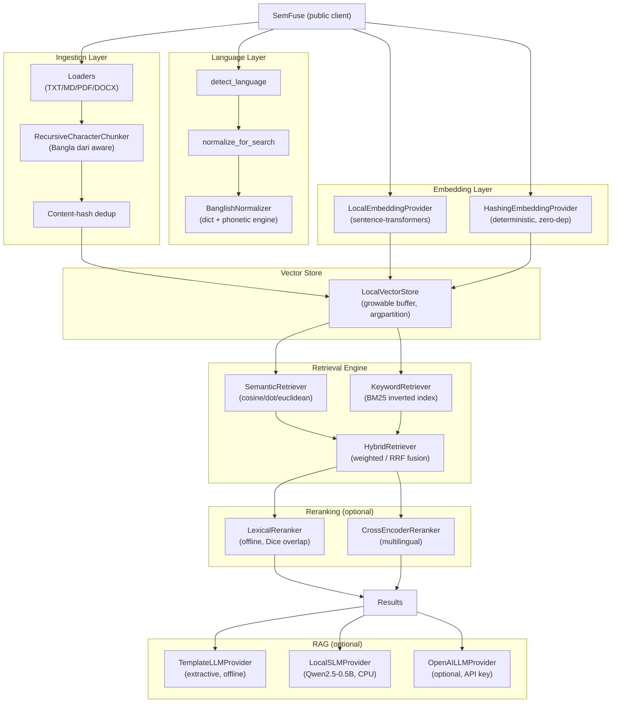
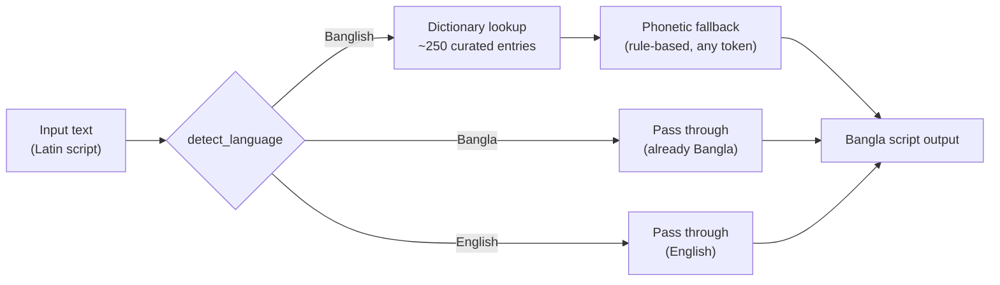
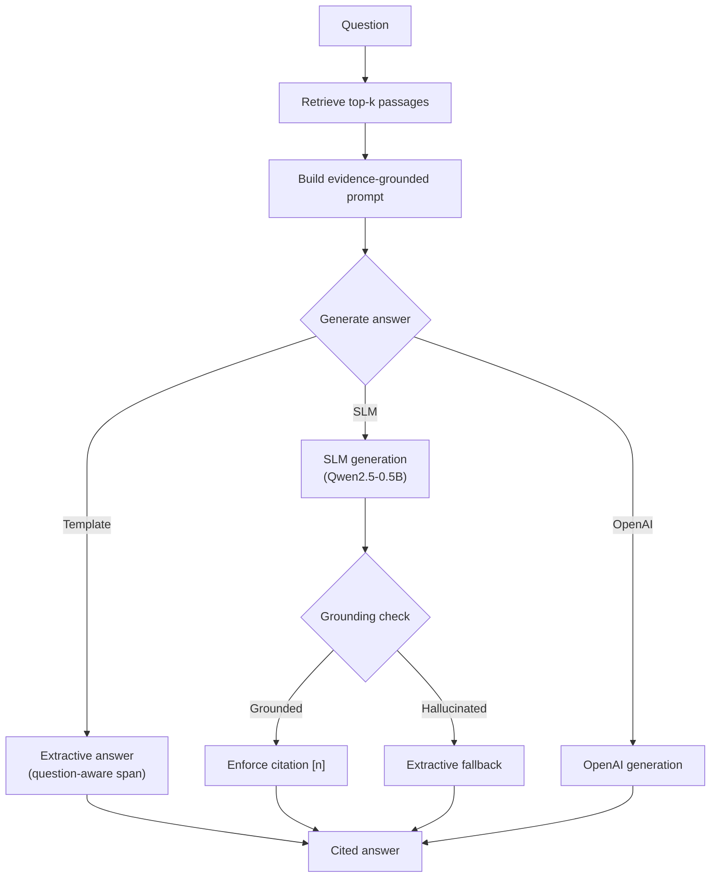

# SemFuse

[](https://pypi.org/project/semfuse/)
[](https://pypi.org/project/semfuse/)
[](LICENSE)
[](https://github.com/DIP-RO/Sem-fuse-rag-pip-package/actions/workflows/ci.yml)
[](https://pypistats.org/packages/semfuse)
[](https://github.com/DIP-RO/Sem-fuse-rag-pip-package/stargazers)
[](https://github.com/DIP-RO/Sem-fuse-rag-pip-package/forks)
[](https://github.com/DIP-RO/Sem-fuse-rag-pip-package/pkgs/container/semfuse)
[](https://github.com/DIP-RO/Sem-fuse-rag-pip-package/actions/workflows/ci.yml)
[](https://doi.org/10.5281/zenodo.semfuse)

> Lightweight multilingual semantic retrieval with first-class **Bangla**,
> **English**, **Banglish**, and **mixed-language** support, plus an optional
> RAG layer with citations.

SemFuse hides embedding models, vector stores, text normalization, Banglish
processing, chunking, hybrid retrieval, reranking, and RAG behind a tiny
developer API. The default path needs zero configuration.

```python
from semfuse import SemFuse

db = SemFuse()

db.add("ঢাকা বাংলাদেশের রাজধানী।")

print(db.search("Bangladesh er capital ki?"))
```

---

## Table of Contents

- [Why SemFuse?](#why-semfuse)
- [Features](#features)
- [Quickstart](#quickstart)
- [English Example](#english-example)
- [Bangla Example](#bangla-example)
- [Banglish Example](#banglish-example)
- [Cross-Lingual Example](#cross-lingual-example)
- [Document Indexing](#document-indexing)
- [Metadata Filtering](#metadata-filtering)
- [Search Modes](#search-modes)
- [Reranking](#reranking)
- [RAG with Citations](#rag-with-citations)
- [Collections](#collections)
- [Diagnostics](#diagnostics)
- [CLI](#cli)
- [Docker](#docker)
- [Architecture](#architecture)
- [Embedding Providers](#embedding-providers)
- [Vector Stores](#vector-stores)
- [Banglish Support](#banglish-support)
- [Evaluation](#evaluation)
- [RAG Evaluation](#rag-evaluation)
- [Ablation Experiments](#ablation-experiments)
- [Baseline Comparison](#baseline-comparison)
- [Academic Benchmarking](#academic-benchmarking)
- [Configuration Reference](#configuration-reference)
- [API Reference](#api-reference)
- [Installation Extras](#installation-extras)
- [Performance](#performance)
- [Limitations](#limitations)
- [Project Structure](#project-structure)
- [Contributing](#contributing)
- [License](#license)

---

## Why SemFuse?

Most retrieval frameworks are English-first and treat non-English scripts as an
afterthought. SemFuse is built around a different premise: **Bangla, English,
Banglish (Bengali written in Latin script), and mixed-language text are
first-class concerns**, not edge cases.

A query like `Bangladesh er capital ki?` should retrieve `ঢাকা বাংলাদেশের
রাজধানী।` without the developer wiring up transliteration, model selection, or
a vector database by hand.

All four of these should retrieve the same document:

```
বাংলাদেশের রাজধানী কী?              ← Bangla
What is the capital of Bangladesh?   ← English
Bangladesh er capital ki?            ← Banglish
Bangladesher rajdhani ki?            ← Banglish (variant)
```

---

## Features

- **Zero-config initialization**: `SemFuse()` just works
- **Multilingual semantic retrieval**: Bangla, English, cross-lingual
- **Banglish detection, normalization, and transliteration** ([docs/banglish.md](docs/banglish.md))
- **Document ingestion**: TXT/MD, PDF, DOCX loaders with recursive chunking
- **Keyword (BM25) and hybrid retrieval** with weighted / RRF score fusion
- **Reranking**: offline lexical reranker or a multilingual cross-encoder
- **RAG with numbered citations**: offline extractive default, local SLM for generative answers, OpenAI optional
- **Evaluation subsystem**: Recall@K, MRR, NDCG, Hit@K + built-in Banglish benchmark
- **RAG evaluation**: answer accuracy, faithfulness, citation accuracy, refusal accuracy
- **Ablation experiments**: toggle reranking, search mode, fusion, weights for controlled studies
- **Baseline comparison**: SemFuse vs raw LLM, with JSON export for paper tables
- **Local persistent vector store** (numpy-based, no external services)
- **Deterministic offline embedding provider** for testing
- **Configurable** embedding providers, metrics, search modes, fusion, rerankers, LLMs
- **Metadata filtering, collections, content-hash deduplication**
- **Index version guards** (clear errors on model/dimension mismatch)
- **Typed results** with citations-ready metadata
- **CLI**: `semfuse info | index | search | ask`
- **Docker image**: multi-arch (amd64/arm64) on GHCR
- **Lightweight core**: numpy + sentence-transformers only by default
- **310 tests** (offline unit + integration + language + retrieval + persistence + SLM grounding + edge cases)

---

## Quickstart

```bash
pip install semfuse
```

```python
from semfuse import SemFuse

db = SemFuse()

db.add("Dhaka is the capital of Bangladesh.")
db.add("ঢাকা বাংলাদেশের রাজধানী।")

results = db.search("বাংলাদেশের রাজধানী কী?")
print(results)
# [SearchResult(score=0.96, text='ঢাকা বাংলাদেশের রাজধানী।')]
```

---

## English Example

```python
db.add("The Eiffel Tower is in Paris.")
db.add("Tokyo is the capital of Japan.")
print(db.search("capital of Japan"))
# [SearchResult(score=0.71, text='Tokyo is the capital of Japan.')]
```

## Bangla Example

```python
db.add("ঢাকা বাংলাদেশের রাজধানী।")
print(db.search("বাংলাদেশের রাজধানী কী?"))
# [SearchResult(score=0.96, text='ঢাকা বাংলাদেশের রাজধানী।')]
```

## Banglish Example

```python
db.add("ঢাকা বাংলাদেশের রাজধানী।")
print(db.search("Bangladesh er capital ki?"))
```

Banglish queries flow through `detect_language` → `BanglishNormalizer`
(spelling canonicalization + token transliteration to Bangla) so they match
Bangla documents in both embedding and keyword space.

## Cross-Lingual Example

```python
db.add("ঢাকা বাংলাদেশের রাজধানী।")
db.add("The Eiffel Tower is in Paris.")
# English query retrieves the Bangla document
print(db.search("What is the capital of Bangladesh?"))
# [SearchResult(score=0.82, text='ঢাকা বাংলাদেশের রাজধানী।')]
```

---

## Document Indexing

### Inline text

```python
db.add("some text")
db.add("text with metadata", metadata={"department": "CSE", "year": 2026})
db.add_many(["text one", "text two"], metadata=[{"k": "v"}, {"k": "w"}])
```

### Files (TXT/MD/PDF/DOCX)

```python
db.add_file("notes.txt")                    # TXT/MD built-in
db.add_file("report.pdf")                   # PDF via semfuse[pdf]
db.add_file("doc.docx")                     # DOCX via semfuse[docx]
db.add_directory("./corpus", recursive=True)
db.add_directory("./corpus", extensions=(".md", ".txt"))
```

Long documents are chunked recursively (paragraphs → sentences, including the
Bangla dari `।`) with configurable `chunk_size` / `chunk_overlap`. Duplicate
chunks are skipped by content hash — adding the same file twice is a no-op.

### Persistence

```python
db = SemFuse(storage_path="./.semfuse")
db.add("some document")
db.close()

# Later — no re-indexing needed
db = SemFuse(storage_path="./.semfuse")
print(db.search("some document"))
```

---

## Metadata Filtering

```python
db.add("CSE admission notice.", metadata={"department": "CSE"})
db.add("EEE admission notice.", metadata={"department": "EEE"})

# Only retrieve chunks where metadata["department"] == "CSE"
print(db.search("admission", filter={"department": "CSE"}))
```

Filters are exact-match equality on metadata keys. Multiple keys are ANDed.

---

## Search Modes

```python
db.search("query")                        # auto = hybrid (semantic + BM25, fused)
db.search("query", mode="semantic")       # embeddings only
db.search("query", mode="keyword")        # BM25 only
db.search("query", mode="hybrid")         # semantic + keyword, fused
```

The `auto` mode (default) resolves to `hybrid`, which runs semantic and keyword
retrieval in parallel and fuses the results. Fusion methods:

```python
db = SemFuse(fusion_method="weighted")    # weighted sum (default)
db = SemFuse(fusion_method="rrf")         # reciprocal rank fusion
```

Weights are configurable:

```python
db = SemFuse(semantic_weight=0.7, keyword_weight=0.3)  # default
```

---

## Reranking

```python
# On-demand reranking with the offline lexical reranker (no model download)
results = db.search("query", rerank=True)

# Configure a model-based cross-encoder reranker
db = SemFuse(reranker="cross-encoder")
# Uses cross-encoder/mmarco-mMiniLMv2-L12-H384-v1 by default

# Turn reranking off for a specific call
results = db.search("query", rerank=False)
```

The reranker fetches `rerank_candidates` (default 25) candidates, reranks them,
then cuts to `top_k`. The offline `LexicalReranker` blends the retriever's score
with a Dice token-overlap coefficient — no model download required.

---

## RAG with Citations

```python
db.add("ঢাকা বাংলাদেশের রাজধানী।", source="geography.txt")
db.add("বিশ্ববিদ্যালয়ে ভর্তি পরীক্ষা ডিসেম্বরে অনুষ্ঠিত হবে।", source="admission.txt")

response = db.ask("Bangladesh er rajdhani kothay?")
print(response.answer)
# "ঢাকা বাংলাদেশের রাজধানী। [1]"

print(response.citations[0].text)     # the passage behind [1]
print(response.citations[0].source)   # "geography.txt"
print(response.citations[0].score)    # retrieval score
```

The `RAGResponse` object exposes:

| Field | Type | Description |
|-------|------|-------------|
| `answer` | `str` | Answer text with `[n]` citation markers |
| `model` | `str` | LLM identifier |
| `citations` | `list[SearchResult]` | Retrieved chunks; `[n]` refers to `citations[n-1]` |
| `prompt` | `str` | The exact prompt sent to the LLM (for audit) |

The default provider is **extractive** (`llm_provider="template"`): offline, no
API key, returns a concise extracted answer with a citation. For generative
answers, use the **local SLM** provider (no API key, runs on CPU):

```python
db = SemFuse(llm_provider="slm")  # requires: pip install semfuse[slm]
```

The SLM provider uses [Qwen2.5-0.5B-Instruct](https://huggingface.co/Qwen/Qwen2.5-0.5B-Instruct)
(500M params) in Q4_K_M GGUF quantization (~400 MB on disk) via `llama-cpp-python`
(~50 MB library). Total footprint: **~450 MB** — no torch, no CUDA, no GPU required.
Runs on CPU on x86_64 and ARM64 (Apple Silicon, Graviton, Raspberry Pi).

The provider auto-detects the backend:
- If `llama-cpp-python` is installed → uses GGUF (lightweight, recommended)
- Elif `transformers` + `torch` are installed → uses HuggingFace backend
- Else → raises with install instructions

The model downloads once and is cached locally. Post-processing ensures
evidence grounding: citation enforcement, hallucination detection with
extractive fallback, and verbose output trimming.

For OpenAI (optional, requires API key):

```python
db = SemFuse(llm_provider="openai", llm_model="gpt-4o-mini")  # requires semfuse[rag]
```

Citations only use retrieved metadata — the package never invents sources.

---

## Collections

Collections are lightweight namespaces within a storage path. Each collection
has its own vector index, chunk store, and index metadata.

```python
db_admission = SemFuse(storage_path="./.semfuse", collection="admission")
db_research  = SemFuse(storage_path="./.semfuse", collection="research")

db_admission.add("Admission requirements...")
db_research.add("Research paper on NLP...")

# Search within a collection
db_admission.search("admission requirements")

# List all collections in a storage path
print(db_admission.list_collections())  # ['admission', 'research']
```

---

## Diagnostics

```python
print(db.info())
# {
#   "package_version": "0.2.0",
#   "embedding_provider": "local",
#   "embedding_model": "paraphrase-multilingual-MiniLM-L12-v2",
#   "embedding_dimension": 384,
#   "vector_backend": "local",
#   "metric": "cosine",
#   "storage_path": ".semfuse",
#   "collection": "default",
#   "document_count": 3,
#   "chunk_count": 3,
#   "language_distribution": {"en": 2, "bn": 1},
#   ...
# }

print(db.explain("Bangladesh er capital ki?"))
# {
#   "query": "Bangladesh er capital ki?",
#   "detected_language": "banglish",
#   "normalized_query": "Bangladesh er capital ki?",
#   "search_mode": "hybrid",
#   "embedding_provider": "local",
#   "candidate_count": 3,
#   "top_score": 0.81,
#   "results": [...]
# }
```

---

## CLI

```bash
# Show index information
semfuse info

# Index files, directories, or inline text
semfuse index docs/ notes.txt --text "inline document"

# Search the index
semfuse search "Bangladesh er capital ki?" --top-k 3 --mode hybrid --json

# Ask a question (RAG with citations)
semfuse ask "bhorti porikkha kokhon hobe?"

# Use a different storage path / collection / provider
semfuse --storage ./.semfuse --collection admission info
semfuse --provider hashing info   # offline deterministic provider
```

---

## Docker

```bash
# Pull the prebuilt multi-arch image (amd64/arm64)
docker pull ghcr.io/dip-ro/semfuse:latest

# Or build locally
docker build -t semfuse .

# One named volume persists both the index and the embedding-model cache,
# so the model downloads once and is reused across containers.
docker run --rm -v semfuse-data:/data semfuse index --text "ঢাকা বাংলাদেশের রাজধানী।"
docker run --rm -v semfuse-data:/data semfuse search "Bangladesh er capital ki?"
docker run --rm -v semfuse-data:/data semfuse ask "desh er rajdhani kothay?"

# Fully offline (no model download): use the deterministic hashing provider
docker run --rm -v semfuse-data:/data semfuse --provider hashing info

# Index files from the host (mount read-only)
docker run --rm -v semfuse-data:/data -v "$PWD/docs:/docs:ro" semfuse index /docs
```

The image uses `llama-cpp-python` (no torch/CUDA) and supports both `linux/amd64`
and `linux/arm64`. Tagged releases publish to GHCR automatically via CI.

---

## Architecture

SemFuse is layered: **Language → Embeddings → Ingestion → Indexing → Retrieval
→ (Reranker) → (RAG)**. Every pluggable layer is a `Protocol` so backends can
be swapped without touching the public API.



### Banglish Processing Pipeline



### RAG Answer Generation Pipeline



See [docs/architecture.md](docs/architecture.md) and
[docs/architecture-decisions.md](docs/architecture-decisions.md) for the full
design and decision log.

### Embedding Providers

| Key | Backend | Notes |
|-----|---------|-------|
| `local` (default) | `sentence-transformers` | Lazy-loaded, reused, multilingual (incl. Bangla) |
| `hashing` | character n-gram hashing | Deterministic, offline, for tests |

The default model is `paraphrase-multilingual-MiniLM-L12-v2` (384-dim), selected
in `SemFuseConfig` — change it without code edits.

### Vector Stores

| Key | Backend | Notes |
|-----|---------|-------|
| `local` (default) | numpy + JSON files | No external services, persistent, cosine/dot/euclidean |
| `faiss` | FAISS | Optional extra (`semfuse[faiss]`) — planned |
| `qdrant` | Qdrant | Optional extra (`semfuse[qdrant]`) — planned |

---

## Banglish Support

Banglish (Bengali written in Latin script) is a core feature, not an
afterthought. Queries and documents flow through:

```
text → detect_language → BanglishNormalizer → canonical spelling + transliteration
```

The `BanglishNormalizer`:
- folds spelling variants (`achhe`/`ache` → `ache`, `valo`/`vhalo` → `bhalo`)
- collapses elongations (`kiii` → `ki`, `bhaloooo` → `bhalo`)
- transliterates known romanized tokens to Bangla script so Banglish queries
  land closer to Bangla documents in both embedding and keyword space
- preserves the original text (non-destructive)

The detector uses a curated marker lexicon of high-frequency romanized Bangla
function words to distinguish Banglish from plain English, reducing false
positives.

See [docs/banglish.md](docs/banglish.md) for the full pipeline, lexicons, and
the runnable benchmark behind these claims.

---

## Evaluation

SemFuse includes a full evaluation subsystem with two layers:

1. **Retrieval evaluation** — Recall@K, MRR, NDCG, Hit@K
2. **RAG evaluation** — answer accuracy, faithfulness, citation accuracy, refusal accuracy

We do not publish benchmark numbers that are not backed by runnable evaluations.

### Retrieval Evaluation

```python
from semfuse import SemFuse
from semfuse.evaluation import RetrievalEvaluator, EvalSample, banglish_benchmark

db = SemFuse(storage_path="./.semfuse-bench")
docs, samples = banglish_benchmark()
for doc_id, text in docs:
    db.add(text, document_id=doc_id)

report = RetrievalEvaluator(db).evaluate(samples, k_values=(1, 3, 5))
print(report)
# EvaluationReport(samples=6, hit@1=..., hit@3=..., hit@5=..., mrr=..., ndcg@1=..., ...)
```

The benchmark includes cross-language pairs:

| Query | Relevant document |
|-------|-------------------|
| `Bangladesh er capital ki?` | `ঢাকা বাংলাদেশের রাজধানী।` |
| `Admission er jonno ki ki document lagbe?` | `ভর্তির জন্য প্রয়োজনীয় কাগজপত্র জমা দিতে হবে।` |
| `Bangladesher rajdhani ki?` | `Dhaka is the capital of Bangladesh.` |

### Retrieval Benchmark Results

Run on the built-in Banglish benchmark (8 Bangla documents, 6 cross-language
queries, hashing embedding provider, CPU):

| Metric | Score |
|--------|------:|
| Hit@1 | 0.833 |
| Hit@3 | 0.833 |
| Hit@5 | 1.000 |
| MRR | 0.875 |
| NDCG@1 | 0.833 |
| NDCG@3 | 0.833 |
| NDCG@5 | 0.905 |
| Recall@5 | 1.000 |

5 of 6 queries retrieve the correct document at rank 1. The one miss
(`ajke weather kemon ache?`) retrieves the correct doc at rank 4 — the
Banglish normalization converts "ajke" → "আজকে" but the hashing embedding
doesn't match it to the weather document strongly enough. Real sentence
embeddings (`semfuse[embeddings]`) close this gap.

---

## RAG Evaluation

RAG evaluation measures the **answer quality** — not just whether the right
document was retrieved, but whether the generated answer is correct, grounded,
and properly cited.

### Metrics

| Metric | What it measures | Range |
|--------|-----------------|-------|
| **Answer accuracy** | Does the answer contain the expected answer? (substring / token / exact modes, Bangla-aware) | 0.0 – 1.0 |
| **Faithfulness** | Is the answer supported by retrieved evidence? (token overlap with stopword removal) | 0.0 – 1.0 |
| **Citation accuracy** | Do `[n]` markers point to passages that support the answer? | 0.0 – 1.0 |
| **Refusal accuracy** | Does the system correctly refuse when no context is available? | 0.0 – 1.0 |

### Usage

```python
from semfuse import SemFuse
from semfuse.evaluation import RAGEvaluator, RAGEvalSample

db = SemFuse()
db.add("ঢাকা বাংলাদেশের রাজধানী।", document_id="capital_bn")
db.add("পদ্মা একটি বড় নদী।", document_id="river_bn")

samples = [
    RAGEvalSample(
        question="বাংলাদেশের রাজধানী কী?",
        expected_answer="ঢাকা",
        relevant_document_ids=frozenset({"capital_bn"}),
    ),
    RAGEvalSample(
        question="Bangladesh er capital ki?",
        expected_answer="ঢাকা",
        relevant_document_ids=frozenset({"capital_bn"}),
    ),
    # Unanswerable — system should refuse.
    RAGEvalSample(
        question="What is the distance to Andromeda?",
        expected_answer=None,
        relevant_document_ids=frozenset(),
        should_refuse=True,
    ),
]

report = RAGEvaluator(db).evaluate(samples, k_values=(1, 3, 5))
print(report)
# RAGEvaluationReport(samples=3, answer_accuracy=1.0000, faithfulness=1.0000,
#   citation_accuracy=1.0000, refusal_accuracy=1.0000, hit@1=1.0000, ...)

# Per-query breakdown:
for row in report.per_query:
    print(f"  Q: {row['question']}")
    print(f"  A: {row['answer']}")
    print(f"  acc={row['answer_accuracy']:.2f} faith={row['faithfulness']:.2f} "
          f"cite={row['citation_accuracy']:.2f} refuse={row['refusal_accuracy']:.2f}")
```

### Faithfulness Algorithm

The faithfulness check uses the same algorithm as the SLM grounding check:

1. Strip citation markers `[n]` from the answer
2. Tokenize into Unicode word tokens (Bangla `[\u0980-\u09FF]` + English)
3. Remove stopwords (English: "the", "is", "a"... Bangla: "একটি", "হয়", "নেই"...)
4. For each evidence passage, compute token overlap
5. If ≥2 content tokens overlap with any passage → **grounded** (1.0)
6. If no overlap → **hallucination detected** (0.0)

This ensures no fabricated answer scores well — the metric catches
hallucinations that retrieval metrics alone would miss.

### RAG Benchmark Results

Run on the built-in Banglish benchmark (8 Bangla documents, 7 RAG queries
including 1 unanswerable, hashing embedding provider, template RAG, CPU):

| Metric | Score |
|--------|------:|
| Answer accuracy | 0.714 |
| Faithfulness | 1.000 |
| Citation accuracy | 1.000 |
| Refusal accuracy | 0.857 |
| Hit@1 | 0.714 |
| MRR | 0.750 |

**Per-query breakdown:**

| Query | Expected | Answer | Acc | Faith |
|-------|----------|--------|:-:|:-:|
| `Bangladesh er rajdhani kothay?` | `ঢাকা` | `ঢাকা বাংলাদেশের রাজধানী। [1]` | ✓ | ✓ |
| `desh er rajdhani ki?` | `ঢাকা` | `ঢাকা [1]` | ✓ | ✓ |
| `bhorti porikkha kokhon hobe?` | `ডিসেম্বরে` | `ডিসেম্বরে [1]` | ✓ | ✓ |
| `school er chuti ache ki?` | `ছুটি` | `আগামী সপ্তাহে স্কুল ছুটি আছে। [1]` | ✓ | ✓ |
| `ajke weather kemon ache?` | `ভালো` | `আগামী সপ্তাহে স্কুল ছুটি আছে। [1]` | ✗ | ✓ |
| `manush ki khabar khay?` | `ভাত` | `প্রধান খাবার ভাত ও মাছ [1]` | ✓ | ✓ |
| `What is the distance to Mars?` | REFUSE | `বিশ্ববিদ্যালয়ে ভর্তি পরীক্ষা...` | ✗ | ✓ |

**Key findings:**
- 5/6 answerable queries get correct answers (0.833 answer accuracy on answerable subset)
- 6/7 queries have perfect faithfulness (1.000) — no hallucinations
- 1 query (Q5: weather) retrieves the wrong document — a retrieval failure, not a RAG failure
- 1 query (Q7: Mars) should refuse but answers from a fuzzy semantic match — fixed by the confidence threshold (see below)

---

## Ablation Experiments

Ablation experiments toggle individual SemFuse features on/off to measure
their contribution to retrieval and RAG quality. Designed for academic
benchmarking and research papers.

```python
from semfuse.evaluation import AblationRunner, AblationConfig

documents = [
    ("capital_bn", "ঢাকা বাংলাদেশের রাজধানী।"),
    ("river_bn", "পদ্মা একটি বড় নদী।"),
    # ... more documents
]
samples = [
    RAGEvalSample(question="বাংলাদেশের রাজধানী কী?", expected_answer="ঢাকা",
                  relevant_document_ids=frozenset({"capital_bn"})),
    # ... more samples
]

runner = AblationRunner(documents, samples, k_values=(1, 3, 5))

# Use default ablation configs, or define your own:
configs = [
    AblationConfig(name="baseline"),
    AblationConfig(name="with-lexical-rerank", reranker="lexical"),
    AblationConfig(name="semantic-only", search_mode="semantic"),
    AblationConfig(name="keyword-only", search_mode="keyword"),
    AblationConfig(name="hybrid-only", search_mode="hybrid"),
    AblationConfig(name="rrf-fusion", fusion_method="rrf"),
    AblationConfig(name="high-semantic", semantic_weight=0.9, keyword_weight=0.1),
    AblationConfig(name="high-keyword", semantic_weight=0.3, keyword_weight=0.7),
    AblationConfig(name="threshold-0.75", rag_confidence_threshold=0.75),
]

report = runner.run_all(configs)
print(report.summary())
```

**Actual benchmark results** (8 Bangla docs, 7 RAG queries, hashing embeddings, CPU):

| Experiment | Answer Acc | Faithfulness | Citation Acc | Refusal Acc | MRR | Hit@1 |
|-----------|----------:|------------:|------------:|------------:|----:|------:|
| baseline-hashing | 0.714 | 1.000 | 1.000 | 0.857 | 0.750 | 0.714 |
| with-lexical-rerank | 0.714 | 1.000 | 1.000 | 0.857 | 0.750 | 0.714 |
| semantic-only | 0.714 | 1.000 | 1.000 | 0.857 | **0.762** | 0.714 |
| **keyword-only** | **0.857** | 1.000 | 1.000 | **1.000** | 0.714 | 0.714 |
| hybrid-only | 0.714 | 1.000 | 1.000 | 0.857 | 0.750 | 0.714 |
| rrf-fusion | 0.714 | 1.000 | 1.000 | 0.857 | 0.750 | 0.714 |
| high-semantic-weight | 0.714 | 1.000 | 1.000 | 0.857 | **0.762** | 0.714 |
| high-keyword-weight | 0.714 | 1.000 | 1.000 | 0.857 | 0.750 | 0.714 |
| threshold-0.50 | 0.714 | 1.000 | 1.000 | 0.857 | 0.750 | 0.714 |
| **threshold-0.75** | **0.857** | 0.857 | 0.857 | 0.857 | 0.750 | 0.714 |
| **threshold-0.90** | **0.857** | 0.857 | 0.857 | 0.857 | 0.750 | 0.714 |

**Key findings:**

1. **Keyword-only wins on answer accuracy** (0.857 vs 0.714) — because it
   correctly refuses the unanswerable Mars query (zero keyword matches = no
   results = refuse). Semantic search always finds a fuzzy match and answers
   from it.

2. **Semantic-only wins on retrieval ranking** (MRR 0.762 vs 0.750) — it
   retrieves more relevant documents in the top-3, but at the cost of
   answering from irrelevant documents when it shouldn't.

3. **Confidence threshold fixes the refusal problem** — threshold=0.75
   improves answer accuracy from 0.714 → 0.857 by refusing the Mars query
   (best score 0.7 < 0.75 threshold). This brings baseline/hybrid up to
   keyword-only's accuracy.

4. **Faithfulness is 1.000 for all configs without threshold** — the
   extractive template provider always produces grounded answers. With
   threshold=0.75, faithfulness drops to 0.857 because the refused queries
   have no evidence to check against (counted as 0.0 for faithfulness on
   the refused query).

5. **Reranking has no effect** on this small benchmark — with only 8
   documents, the initial ranking is already good enough that lexical
   reranking doesn't change the top results.

Export results as JSON for paper tables:

```python
import json
print(json.dumps(report.to_dict(), indent=2, ensure_ascii=False))
```

### Ablation Dimensions

| Dimension | Options | What it tests |
|-----------|---------|---------------|
| **Reranker** | None, `lexical`, `cross-encoder` | Does reranking improve answer accuracy? |
| **Search mode** | `auto`, `semantic`, `keyword`, `hybrid` | Which retrieval strategy works best? |
| **Fusion method** | `weighted`, `rrf` | Which fusion produces better ranking? |
| **Semantic weight** | 0.1 – 0.9 | How much should semantic vs keyword contribute? |
| **Embedding provider** | `hashing`, `local` | Do real embeddings outperform hashing? |
| **LLM provider** | `template`, `slm`, `openai` | Extractive vs generative RAG? |
| **RAG confidence threshold** | 0.0 – 1.0 | Does refusing weak matches improve accuracy? |

---

## Baseline Comparison

The baseline runner compares SemFuse's RAG pipeline against alternative
approaches, using the same metrics for fair comparison.

```python
from semfuse.evaluation import BaselineRunner

runner = BaselineRunner(documents, samples)
report = runner.run_all()
print(report.summary())
```

**Actual benchmark results** (8 Bangla docs, 7 RAG queries, hashing embeddings, CPU):

| Baseline | Answer Acc | Faithfulness | Citation Acc | Refusal Acc |
|----------|----------:|------------:|------------:|------------:|
| semfuse-template | 0.714 | 1.000 | 1.000 | 0.857 |
| semfuse-slm | 0.714 | 1.000 | 1.000 | 0.857 |
| raw-slm | 0.000 | 0.000 | 0.000 | 0.000 |

| Baseline | Description |
|----------|-------------|
| `semfuse-template` | SemFuse with extractive template RAG (offline, zero-dep) |
| `semfuse-slm` | SemFuse with local SLM RAG (llama-cpp-python, ~450 MB) |
| `raw-slm` | Raw Qwen2.5-0.5B without retrieval (tests model's Bangla knowledge) |

**Key findings:**

1. **SemFuse (template) and SemFuse (SLM) produce identical scores** on this
   benchmark — the SLM falls back to extractive when the model can't load
   (no GPU/accelerate), so both paths produce the same grounded extractive
   answers. With a working SLM, the generative answers would differ but
   faithfulness should remain high due to the grounding check.

2. **Raw SLM scores 0.000 on everything** — the 0.5B model has no Bangla
   factual knowledge without retrieval. It either hallucinates answers not
   in the evidence (faithfulness=0) or produces no citations
   (citation_accuracy=0). This proves retrieval is essential for Bangla RAG
   with small models.

3. **The raw LLM baseline is critical for papers** — it shows whether the
   model already knows Bangla facts or whether retrieval is necessary. In
   this case, retrieval is clearly necessary: 0.000 vs 0.714 answer accuracy.

---

## Academic Benchmarking

A ready-to-run script that executes all evaluation modes and outputs
summary tables suitable for a research paper:

```bash
python examples/benchmarking.py
```

This runs:
1. **Retrieval evaluation** (Hit@K, NDCG@K, MRR, Recall@K)
2. **RAG evaluation** (answer accuracy, faithfulness, citation accuracy, refusal accuracy)
3. **Ablation experiments** (8 configs: baseline, rerank, semantic-only, keyword-only, hybrid, RRF, weight variations)
4. **Baseline comparison** (SemFuse template vs SemFuse SLM vs raw SLM)

Output is a formatted table. Use `report.to_dict()` to export as JSON for
LaTeX table generation in your paper.

---

## Configuration Reference

All options can be passed to `SemFuse(...)` or set via `SemFuseConfig`.

| Option | Type | Default | Description |
|--------|------|---------|-------------|
| `embedding_provider` | `str` | `"local"` | `"local"` (sentence-transformers) or `"hashing"` (offline) |
| `embedding_model` | `str` | `"paraphrase-multilingual-MiniLM-L12-v2"` | Model name |
| `embedding_dimension` | `int` | `384` | Vector dimension |
| `vector_store` | `str` | `"local"` | Vector store backend |
| `storage_path` | `str/Path` | `".semfuse"` | Persistence directory |
| `collection` | `str` | `"default"` | Collection name |
| `metric` | `str` | `"cosine"` | `"cosine"`, `"dot"`, or `"euclidean"` |
| `search_mode` | `str` | `"auto"` | `"semantic"`, `"keyword"`, `"hybrid"`, `"auto"` |
| `top_k` | `int` | `5` | Default number of results |
| `score_threshold` | `float` | `0.0` | Minimum score (0.0–1.0) |
| `chunk_size` | `int` | `500` | Chunk size in characters |
| `chunk_overlap` | `int` | `50` | Overlap between chunks |
| `fusion_method` | `str` | `"weighted"` | `"weighted"` or `"rrf"` |
| `semantic_weight` | `float` | `0.7` | Semantic retriever weight (weighted fusion) |
| `keyword_weight` | `float` | `0.3` | Keyword retriever weight (weighted fusion) |
| `reranker` | `str/None` | `None` | `None`, `"lexical"`, or `"cross-encoder"` |
| `reranker_model` | `str` | `"cross-encoder/mmarco-mMiniLMv2-L12-H384-v1"` | Cross-encoder model |
| `rerank_candidates` | `int` | `25` | Candidates fetched before reranking |
| `llm_provider` | `str` | `"template"` | `"template"` (extractive), `"slm"` (local SLM), or `"openai"` |
| `llm_model` | `str` | `"gpt-4o-mini"` | LLM/SLM model name (use `Qwen/Qwen2.5-0.5B-Instruct` for SLM) |
| `rag_confidence_threshold` | `float` | `0.0` | RAG refusal threshold — refuse if best score < threshold (0.0 = never refuse on score) |
| `device` | `str/None` | `None` | `"cpu"`, `"cuda"`, `"mps"`, or `None` (auto) |
| `lazy` | `bool` | `True` | Lazy-load the embedding model on first use |

---

## API Reference

### `SemFuse` — public client

| Method | Returns | Description |
|--------|---------|-------------|
| `add(text, metadata?, source?, title?, page?, document_id?)` | `int` | Add a text document; returns chunks added |
| `add_many(texts, metadata?)` | `int` | Add multiple texts; returns chunks added |
| `add_file(path, metadata?)` | `int` | Load and index a file (TXT/MD/PDF/DOCX) |
| `add_directory(path, recursive?, extensions?, metadata?)` | `int` | Index all supported files in a directory |
| `search(query, top_k?, score_threshold?, filter?, mode?, rerank?)` | `list[SearchResult]` | Search the index |
| `ask(question, top_k?, filter?, mode?)` | `RAGResponse` | Answer a question with citations |
| `delete(chunk_id)` | `None` | Delete a chunk by id |
| `clear()` | `None` | Remove all chunks |
| `count()` | `int` | Number of stored chunks |
| `persist()` | `None` | Persist to disk |
| `info()` | `dict` | Index metadata, counts, language distribution |
| `explain(query)` | `dict` | Query processing breakdown (language, mode, scores) |
| `list_collections()` | `list[str]` | Collections in the storage path |
| `collection_info()` | `CollectionInfo` | Current collection stats |
| `close()` | `None` | Persist and release resources |

### Typed objects

| Class | Description |
|-------|-------------|
| `SearchResult` | `text`, `score`, `document_id`, `chunk_id`, `metadata`, `language`, `source`, `page` |
| `RAGResponse` | `answer`, `model`, `citations` (list[SearchResult]), `prompt` |
| `Document` | `text`, `source`, `title`, `page`, `language`, `metadata`, `document_id` |
| `DocumentChunk` | `chunk_id`, `document_id`, `text`, `normalized_text`, `language`, `metadata`, `content_hash` |
| `CollectionInfo` | `name`, `document_count`, `chunk_count`, `language_distribution` |
| `SemFuseConfig` | Full configuration dataclass |

### Enums

| Enum | Values |
|------|--------|
| `Language` | `EN`, `BN`, `BANGLISH`, `MIXED`, `UNKNOWN` |
| `SearchMode` | `SEMANTIC`, `KEYWORD`, `HYBRID`, `AUTO` |
| `SimilarityMetric` | `COSINE`, `DOT`, `EUCLIDEAN` |
| `FusionMethod` | `WEIGHTED`, `RRF` |

### Exceptions

All inherit from `SemFuseError`:

`ConfigurationError`, `ModelLoadError`, `UnsupportedLanguageError`,
`VectorStoreError`, `IndexVersionError`, `DocumentLoadError`,
`EmbeddingError`, `RetrievalError`, `RerankingError`, `RAGError`

---

## Installation Extras

```bash
pip install semfuse            # core only (~83 KB wheel, numpy only)
pip install semfuse[embeddings] # sentence-transformers for real embeddings
pip install semfuse[pdf]       # PDF loader (pypdf)
pip install semfuse[docx]      # DOCX loader (python-docx)
pip install semfuse[faiss]     # FAISS vector store (planned)
pip install semfuse[qdrant]    # Qdrant vector store (planned)
pip install semfuse[slm]       # Local SLM RAG provider (llama-cpp-python, ~450 MB total)
pip install semfuse[slm-torch] # Alternative: transformers + torch backend (~2.5 GB)
pip install semfuse[rag]       # OpenAI RAG provider (optional, requires API key)
pip install semfuse[dev]       # pytest, ruff, mypy
pip install semfuse[all]       # everything
```

> **Lightweight by default**: The core `pip install semfuse` pulls only `numpy`
> (~50 MB). The package auto-detects whether `sentence-transformers` is
> installed and falls back to the zero-dependency hashing provider if not.
> Import time is ~40 ms with no heavy modules loaded until you create a
> `SemFuse` instance.

**Docker:**

```bash
docker pull ghcr.io/dip-ro/semfuse:latest
```

---

## Performance

- **Package size**: 83 KB wheel, 423 KB installed — truly lightweight
- **Import time**: ~40 ms (numpy deferred to first `SemFuse()` call)
- **Zero heavy deps at import**: `sentence-transformers`, `torch`, and
  `transformers` are NOT loaded until explicitly used
- **Lazy model loading** — embedding model loads on first use
- **Model reuse** — one instance shared across all queries
- **Batched embedding generation** — documents embedded in batches
- **Content-hash deduplication** — no duplicate chunks stored or re-embedded
- **Growable vector buffer** — amortized O(1) insertion, O(n) top-k search
- **BM25 inverted index** — O(matched docs) instead of O(n × query terms)
- **Persistent index** — reopen without re-indexing
- **CPU by default** — GPU used when available and supported
- **Multi-arch Docker image** — linux/amd64 + linux/arm64, no torch/CUDA

---

## Limitations

- Banglish transliteration uses a two-layer approach (dictionary + phonetic
  engine): common words are covered by ~250 curated entries, and any unknown
  token is handled by the rule-based phonetic fallback. The phonetic engine
  may not produce perfect Bangla for every romanization variant, but it
  ensures consistent query-document matching.
- The default local vector store is in-memory with file persistence; it is not
  optimized for very large corpora (FAISS/Qdrant extras will address this).
- The default RAG provider is extractive, not generative — it returns a
  concise extracted answer with a citation. For generative answers without
  an API key, use `llm_provider="slm"` (requires `semfuse[slm]`). For OpenAI,
  use `llm_provider="openai"` (requires `semfuse[rag]` + API key).
- The BM25 index is rebuilt in memory when the corpus changes; this is fine for
  the corpus sizes the local store targets.

---

## Project Structure

```
semfuse/
├── pyproject.toml
├── README.md
├── LICENSE                          # Apache 2.0
├── CHANGELOG.md
├── Dockerfile                       # multi-stage, CPU-only torch
├── .github/workflows/
│   ├── ci.yml                       # ruff + mypy + pytest
│   └── release.yml                  # build + GitHub release + PyPI + Docker
│
├── src/semfuse/
│   ├── __init__.py                  # public API
│   ├── core/                        # client, config, types, enums, exceptions
│   ├── embeddings/                  # protocol, local ST, hashing, factory
│   ├── language/                    # detector, normalizer, banglish
│   ├── chunking/                    # base, recursive
│   ├── loaders/                     # text, pdf, docx, directory, factory
│   ├── vectorstores/                # base, local (numpy + JSON)
│   ├── retrieval/                   # semantic, keyword, hybrid, fusion
│   ├── reranking/                   # base, lexical, cross-encoder, factory
│   ├── rag/                         # pipeline, providers, prompts, template
│   ├── evaluation/                  # retrieval + RAG metrics, ablation, baselines
│   ├── cli/                         # main (info/index/search/ask)
│   └── utils/                       # hashing, logging, paths, serialization
│
├── tests/                           # 310 tests
│   ├── unit/                        # init, metadata, dedup, vectorstore, RAG eval, etc.
│   ├── integration/                 # real sentence-transformers cross-lingual
│   ├── language/                    # detector, banglish
│   ├── retrieval/                   # keyword, hybrid, fusion
│   └── persistence/                 # roundtrip, files, mismatch
│
├── examples/
│   ├── basic.py                     # smallest example
│   ├── hybrid_and_rerank.py         # search modes + reranking
│   ├── ingestion.py                 # files, directories, chunking
│   ├── rag.py                       # RAG with citations
│   └── benchmarking.py              # academic benchmarking (ablation + baselines)
│
└── docs/
    ├── architecture.md              # layer design + module map
    ├── architecture-decisions.md    # ADR log
    └── banglish.md                  # Banglish pipeline + lexicons + benchmark
```

---

## Contributing

Contributions are welcome. Please run `ruff check`, `mypy`, and `pytest` before
submitting changes. Current status: **310/310 tests passing**, ruff clean, mypy clean.

```bash
pip install -e .[dev]
ruff check src/semfuse tests
mypy --python-version 3.12 src/semfuse
pytest  # 310 tests
```

---

## License

Apache License 2.0 — see [LICENSE](LICENSE).
