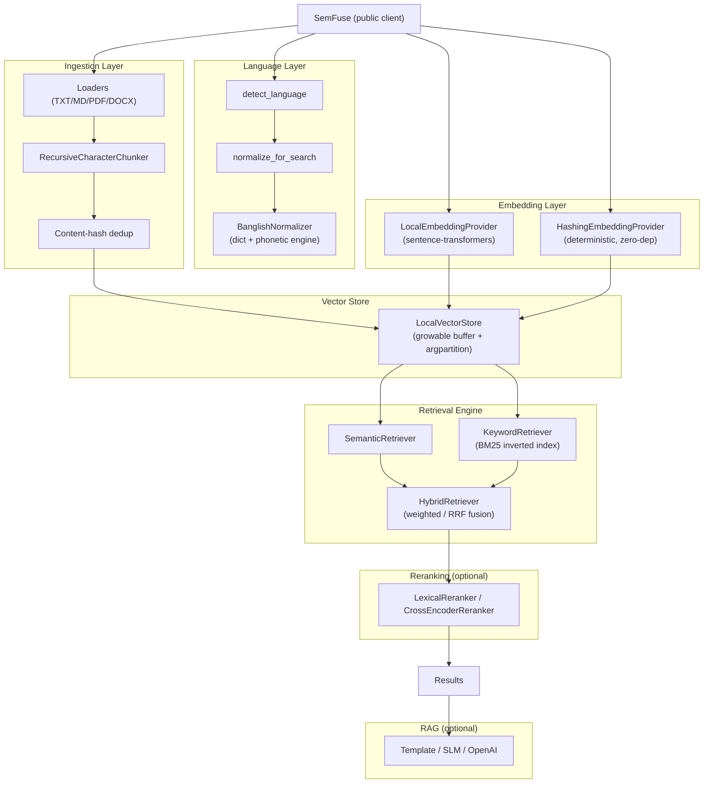
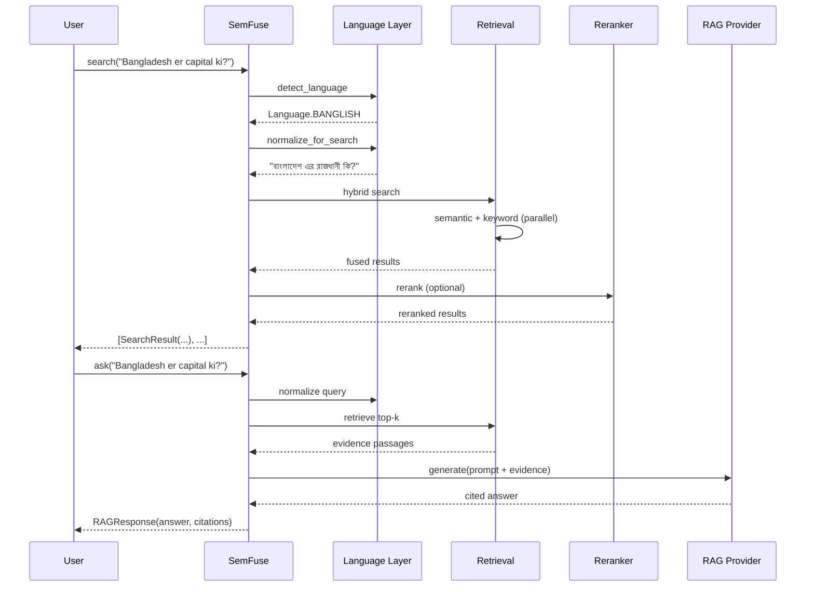

# SemFuse Architecture

> Lightweight, model-agnostic multilingual semantic retrieval engine with
> first-class Bangla, English, Banglish, and mixed-language support, plus an
> optional RAG layer.

## Design principle

**Complex internally, simple externally.**

A beginner writes:

```python
from semfuse import SemFuse

db = SemFuse()
db.add("ঢাকা বাংলাদেশের রাজধানী।")
db.search("Bangladesh er capital ki?")
```

An advanced developer can swap every layer via protocols without touching the
simple path.

## Logical layers



### Data flow: query to answer



## Module map (all phases implemented)

| Layer | Module | Phase |
|-------|--------|-------|
| Public API | `core.client.SemFuse` | 1 |
| Config | `core.config.SemFuseConfig` | 1 |
| Types | `core.types` | 1 |
| Enums | `core.enums` | 1 |
| Exceptions | `core.exceptions` | 1 |
| Embeddings | `embeddings.base`, `embeddings.local`, `embeddings.hashing`, `embeddings.factory` | 1 |
| Vector stores | `vectorstores.base`, `vectorstores.local` | 1 |
| Retrieval | `retrieval.base`, `retrieval.semantic` | 1 |
| Language | `language.base`, `language.detector`, `language.normalizer`, `language.banglish` | 2 |
| Chunking | `chunking.base`, `chunking.recursive` | 3 |
| Loaders | `loaders.base`, `loaders.text`, `loaders.pdf`, `loaders.docx`, `loaders.factory` | 3 |
| Keyword/Hybrid | `retrieval.keyword`, `retrieval.hybrid`, `retrieval.fusion` | 4 |
| Reranking | `reranking.base`, `reranking.lexical`, `reranking.cross_encoder`, `reranking.factory` | 5 |
| RAG | `rag.base`, `rag.prompt`, `rag.template`, `rag.openai_provider`, `rag.pipeline`, `rag.factory` | 6 |
| Evaluation | `evaluation.metrics`, `evaluation.runner`, `evaluation.banglish` | 7 |
| CLI | `cli.main` (`info`/`index`/`search`/`ask`) | 8 |

## Key abstractions (Protocols)

- `EmbeddingProvider` — `embed_documents`, `embed_query`, `dimension`, `model_name`
- `VectorStore` — `add`, `add_many`, `search`, `delete`, `clear`, `count`, `chunks`, `persist`, `load`
- `Retriever` — `retrieve(query, top_k, filter) -> list[SearchResult]`
  (implementations: `SemanticRetriever`, `KeywordRetriever` (BM25),
  `HybridRetriever` (fused))
- `TextChunker` — `split(text) -> list[str]` (`RecursiveCharacterChunker`)
- `DocumentLoader` — `load(path) -> list[Document]` (TXT/MD, PDF, DOCX)
- `LanguageDetector`, `TextNormalizer` — language layer; `BanglishNormalizer`
  canonicalizes and transliterates romanized Bangla (see `docs/banglish.md`)
- `Reranker` — `rerank(query, results, top_k)` (`LexicalReranker`,
  `CrossEncoderReranker`)
- `LLMProvider` — `generate(prompt)` (`TemplateLLMProvider`,
  `OpenAILLMProvider`)

## Dependency strategy

- **Core runtime deps:** `numpy` only. Kept intentionally light.
- **Default embedding backend:** `sentence-transformers` (lazy-loaded). Pulled in
  via the default install because semantic retrieval *is* the product. Loaded once
  and reused; never instantiated per query.
- **Optional extras:** `semfuse[pdf]`, `semfuse[docx]`, `semfuse[qdrant]`,
  `semfuse[faiss]`, `semfuse[rag]`, `semfuse[dev]`, `semfuse[all]`.
- No LangChain / LlamaIndex orchestration frameworks in core.

## Persistence

The local vector store serializes embeddings (`.npy`), document/chunk records
(JSON), and index metadata (JSON) under a configurable `storage_path`. Reopening
a `SemFuse(storage_path=...)` skips re-indexing. Index metadata records the
embedding model name + dimension + version; a mismatch raises
`IndexVersionError` with remediation guidance.

## Test strategy

- **Unit tests** use a deterministic `HashingEmbeddingProvider` (offline, fast,
  no model download) so they run anywhere without internet.
- **Integration / retrieval tests** use the real `sentence-transformers` backend
  and are skipped automatically when the model is unavailable or offline.
